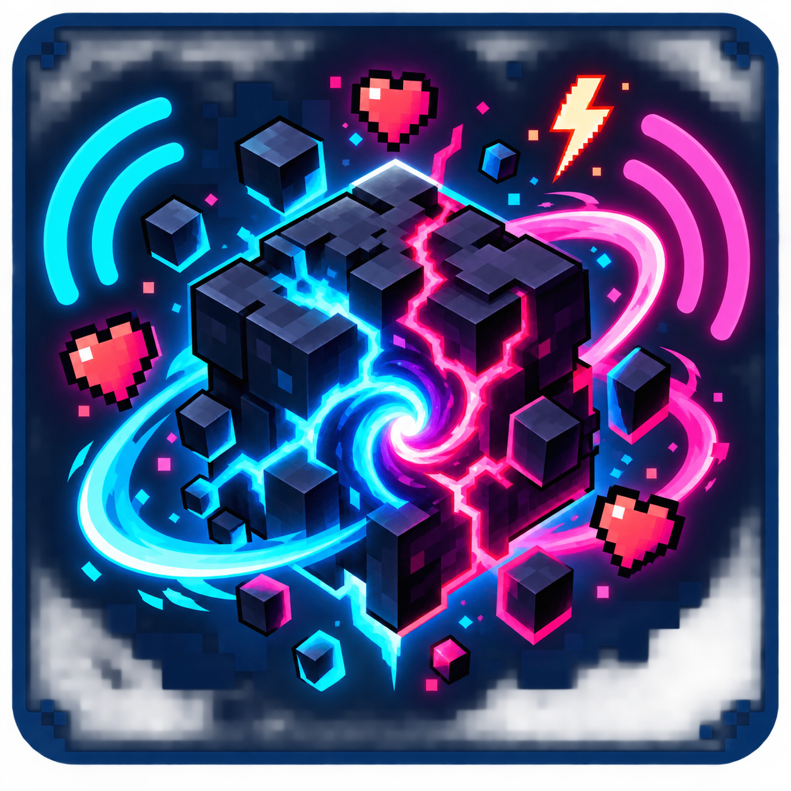

<p align="center">
  <a href="./README.md"><strong>English</strong></a> ·
  <a href="./README.pt-BR.md">Português (Brasil)</a>
</p>

<p align="center">
  
</p>

<h1 align="center">TikTok Chaos</h1>

<p align="center">
  <strong>Turn a public TikTok LIVE into a configurable, visual and controlled Minecraft experience.</strong>
</p>

<p align="center">
  <a href="https://github.com/Pexe171/ModTikTok/actions/workflows/build.yml"></a>
  
  
  
  
  <a href="./LICENSE"></a>
</p>

TikTok Chaos is a client-side mod for **Minecraft Java 1.16.5 through 1.21.1**. Forge builds cover 1.16.5, 1.18.2, 1.19.2, 1.20.1, and 1.21.1; NeoForge is supported on 1.21.1. It connects to a public TikTok LIVE by username and turns likes, gifts, comments, follows, shares and subscriptions into rules that run inside a singleplayer world.

Everything is configured in Minecraft through the `F8` dashboard. No companion desktop app, TikTok password, API key, paid service or JEI installation is required.

> [!IMPORTANT]
> TikTok Chaos is an independent community project. It is not affiliated with or endorsed by TikTok, ByteDance, Mojang, Microsoft, Forge or NeoForge. The LIVE connection uses an unofficial community implementation and may require updates when TikTok changes its protocol.

## Why TikTok Chaos?

- **Visual setup:** choose mobs, items and effects from searchable icon galleries instead of memorizing registry IDs.
- **Modpack-aware:** registered items, effects and spawn-egg-backed mobs from compatible mods appear automatically.
- **Random mode:** choose `Aleatório (todos os mods)` / Random (all mods) to draw a new mob, item or effect on every activation.
- **Real rule editor:** combine conditions, cooldowns, amounts and multiple actions without editing JSON by hand.
- **Built for LIVE traffic:** bounded queues, rate limits, duplicate protection and cached registries keep event bursts controlled.
- **Safe defaults:** temporary mobs, visual-only lightning, no execution of viewer text as commands and no deliberate block-breaking actions.

## How it works

```text
Public TikTok LIVE
        │
        ▼
Community Webcast connector
        │
        ▼
Normalized LIVE event
        │
        ▼
Configurable rule engine ──► bounded priority queue
        │
        ▼
Minecraft integrated server thread
        │
        ▼
Mob, item, effect, teleport, weather or visual action
```

The connector only receives public LIVE events. It does not log in to TikTok, post comments, control the account or open a local web server.

## Visual rule editor

On Minecraft 1.20.1 and 1.21.1, open `F8` → **Rules** → **Edit** and select an action. The 1.16.5–1.19.2 ports use a compact dashboard for connection and simulation; advanced rules on those versions remain editable in `config/tiktok-chaos.json`.

| Action | Visual selection | Extra controls |
| --- | --- | --- |
| Spawn mob | Spawn-egg icon, localized name and registry ID | Amount and automatic lifetime |
| Give item | Real item model, including compatible mod items | Amount |
| Apply effect | Official effect icon, including compatible mod effects | Level and duration |
| Short teleport | — | Radius |
| Temporary weather | — | Duration |
| Message | — | Custom text |

Each gallery supports:

- Search by the localized name or registry ID.
- Search by mod namespace, such as `mekanism:`.
- Mouse-wheel scrolling and hover details.
- Manual `namespace:id` entry for advanced users.
- A first card named **Random (all mods)**.

The catalog is built lazily and cached. Only visible cards are rendered each frame, so large modpacks do not repeatedly scan or draw every registered object.

### Compatibility boundaries

- **Items:** every registered non-air item can appear. Items requiring special NBT/components are given in their default registered form.
- **Effects:** every registered mob effect can appear, including modded effects.
- **Mobs:** entities must have a registered spawn egg. This excludes players, projectiles, technical entities and vanilla bosses without eggs.

## Supported LIVE events

| TikTok LIVE event | Available rule data |
| --- | --- |
| Likes | Accumulated threshold |
| Gifts | Gift ID, diamond/value range and repeat count |
| Comments | Explicit whitelisted command text such as `!zumbi` |
| Follow | Viewer identity |
| Share | Viewer identity |
| Subscription | Viewer identity |
| Join | Viewer identity |
| Room statistics | Viewer count |
| LIVE start/end | Broadcast state |

Gift repeat count is applied to the whole configured action set. For example, if one rose triggers one zombie, a TikTok event with `amount = 3` queues three zombie actions (up to `maxTriggersPerEvent`).

## Included starter rules

| Interaction | Default Minecraft action |
| --- | --- |
| Every 100 accumulated likes | Spawn 1 temporary zombie |
| Follow | Give 4 bread |
| Share | Spawn 1 temporary skeleton |
| Subscription | Give a golden apple and regeneration |
| Comment `!zumbi` | Spawn 1 temporary zombie |
| Comment `!item` | Give a random item from the conservative starter pool |
| Comment `!sorte` | Apply a random positive starter effect |
| Comment `!azar` | Apply a random negative starter effect |
| Gift value 1–9 | Spawn 1 temporary zombie |
| Gift value 10–99 | Spawn 2 temporary skeletons |
| Gift value 100–999 | Spawn 4 temporary zombies, slowness and visual lightning |
| Gift value 1000+ | Spawn 1 temporary ravager, blindness and visual lightning |

These are editable examples, not hard-coded behavior. They can be paused, changed, deleted or replaced from the in-game editor.

## Installation

### Requirements

| Minecraft | Loader | Loader version | Java |
| --- | --- | --- | --- |
| `1.16.5` | Forge | `36.2.34+`, below `37` | 8 |
| `1.18.2` | Forge | `40.3.0+`, below `41` | 17 |
| `1.19.2` | Forge | `43.5.0+`, below `44` | 17 |
| `1.20.1` | Forge | `47.4.10+`, below `48` | 17 |
| `1.21.1` | Forge | `52.1.0+`, below `53` | 21 |
| `1.21.1` | NeoForge | `21.1.133+`, in the `21.1.x` line | 21 |

All builds are client-side, run against the integrated singleplayer server, and require no companion mod.

### Steps

1. Download the `tiktok-chaos-1.3.0+mc<version>-<loader>.jar` file matching both your exact Minecraft version and loader.
2. Put the JAR in the instance's `mods` folder.
3. Start Minecraft and enter a singleplayer world.
4. Press `F8`.
5. Enter the LIVE creator's username without `@`.
6. Select **Connect**.

The creator must currently be LIVE and the broadcast must be public. Private, age-restricted, region-restricted or guest-blocked broadcasts may not be accessible.

## Dashboard

The full `F8` screen on 1.20.1 and 1.21.1 contains:

- **Connection:** username, connection status and automatic reconnect.
- **Rules:** create, edit, pause and combine actions.
- **History:** inspect recent LIVE events and executed actions.
- **Safety:** configure action throughput, mob cap and mob lifetime.
- **Simulator:** test rules without starting a real LIVE.

The compact HUD shows connection state, the latest event, queued actions and tracked temporary mobs.

## Safety model

- Viewer comments are data and are never executed as Minecraft, PowerShell, shell or operating-system commands.
- Only explicitly configured comment triggers are matched.
- Spawned mobs have a configurable global cap and lifetime.
- LIVE actions run through a bounded, rate-limited priority queue.
- Repeated/duplicate events are filtered.
- Lightning created by the mod is visual only and cannot start fire or deal damage.
- The mod does not deliberately change gamerules, clear inventories or run block-breaking actions.
- Random pools are cached once, but all normal action limits still apply to every result.

Random all-mod content can include intentionally chaotic items, effects or creatures supplied by the game or another mod. Back up valuable worlds before using broad random rules.

## Configuration

Settings and rules are stored in:

```text
<minecraft-instance>/config/tiktok-chaos.json
```

The configuration is saved locally. LIVE event history is kept only in memory for the current Minecraft session.

## Troubleshooting

1. Confirm the username is correct and does not include `@`.
2. Confirm the creator is currently LIVE and the broadcast is public.
3. Use **Disconnect** and **Connect** again, or wait for automatic reconnect.
4. Use the **Simulator** tab to separate Minecraft rule problems from TikTok connection problems.
5. Check `logs/latest.log` for `TikTok Chaos` messages.

Large broadcasts may aggregate or omit individual like events. Network, regional and TikTok protocol restrictions can also prevent a connection.

## Build from source

Clone the repository and build the 1.21.1 targets with JDK 21:

```powershell
git clone https://github.com/Pexe171/ModTikTok.git
cd ModTikTok
$env:JAVA_HOME='C:\path\to\jdk-21'
.\gradlew.bat test shadowJar :forge:test :forge:shadowJar
```

Linux/macOS:

```bash
./gradlew test shadowJar :forge:test :forge:shadowJar
```

The NeoForge distributable is generated in `build/libs/`; the Forge distributable is generated in `forge/build/libs/`. Use the JARs without the `thin` classifier.

Legacy Forge builds use their own Gradle 8.8 wrapper and require installed JDK 8 and JDK 17 toolchains:

```powershell
.\ports\forge-legacy\gradlew.bat -p ports\forge-legacy `
  :forge-1.16.5:test :forge-1.16.5:verifyJava8Bytecode `
  :forge-1.18.2:test :forge-1.18.2:shadowJar `
  :forge-1.19.2:test :forge-1.19.2:shadowJar `
  :forge-1.20.1:test :forge-1.20.1:shadowJar
```

Their distributable JARs are generated under `ports/forge-legacy/forge-<minecraft-version>/build/libs/`.

## Project documents

- [Português (Brasil)](./README.pt-BR.md)
- [Changelog](./CHANGELOG.md)
- [Contributing](./CONTRIBUTING.md)
- [Support and bug reports](./SUPPORT.md)
- [Security policy](./SECURITY.md)
- [CurseForge publishing guide](./PUBLISHING.md)
- [Third-party notices](./src/main/resources/META-INF/THIRD_PARTY_NOTICES.txt)

## Credits

**Designed and coded by [Pexe171](https://github.com/Pexe171).**

TikTok Chaos bundles the community [TikTokLiveJava](https://github.com/jwdeveloper/TikTok-Live-Java) connector and its required runtime components. The 1.16.5 build uses [JvmDowngrader](https://github.com/unimined/JvmDowngrader) to remain compatible with Java 8. Complete attribution is available in the third-party notices included in both the source tree and the JAR.

Released under the [MIT License](./LICENSE).
